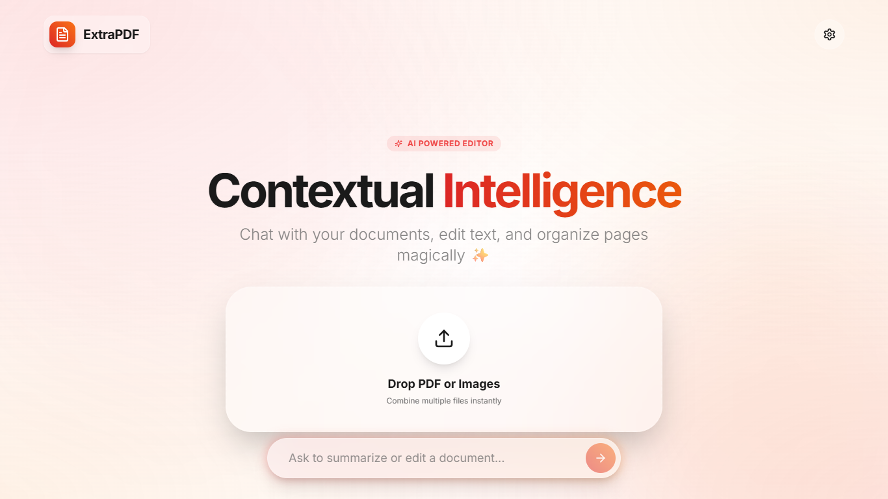

# ExtraPDF - Contextual Intelligence AI PDF Editor

ExtraPDF is a powerful, next-generation PDF editor built with Next.js, AI (Gemini), and advanced client-side PDF processing. It provides a suite of tools for editing, organizing, converting, and securing your documents, wrapped in a beautiful, fluid UI.

## Features

### 🧠 contextual Intelligence
- **AI Chat**: Chat with your document. Ask for summaries, clarifications, or specific edits.
- **Smart Tools**: The AI understands your intent. Ask it to "remove the stamp on page 5" or "rotate all pages", and it will execute the tool for you.

### 🛠️ Full Tool Suite

#### **Edit PDF**
- **Add Text**: Insert custom text with font selection, sizing, and styling.
- **Edit Text**: Modify existing text blocks directly (OCR supported).
- **Draw & Sign**: Freehand drawing tool and dedicated signature mode.
- **Whiteout/Redact**: Cover sensitive information or remove artifacts.
- **Crop**: Crop pages to focus on specific content.
- **Stamp/Watermark**: Add custom stamps or watermarks to your pages.
- **Undo/Redo**: Mistake? No problem. Undo up to 30 actions with `Ctrl+Z` / `Ctrl+Y`.
- **AI Stamp Remover**: Magically remove unwanted stamps or logos using AI vision.

#### **Organize PDF**
- **Merge**: Combine multiple PDFs into one.
- **Split**: Extract specific page ranges into new files.
- **Reorder**: Drag and drop pages to rearrange.
- **Rotate**: Rotate individual pages or the entire document.
- **Delete**: Remove unwanted pages.
- **Remove Empty**: Automatically detect and delete blank pages.
- **Compress**: Optimize file size for sharing.
- **Repair**: Fix corrupted PDF structures.

#### **Convert PDF**
- **PDF to Word (DOCX)**: Extract text and preserve basic structure.
- **PDF to Excel (XLSX)**: Detect tables and export to spreadsheets.
- **PDF to PowerPoint (PPTX)**: Convert pages to presentation slides.
- **PDF to JPG**: specific pages as high-quality images.
- **HTML to PDF**: Convert web content code to PDF.
- **OCR**: Optical Character Recognition to extract text from scanned images.

#### **Security**
- **Compare**: Side-by-side comparison of two PDF documents to spot differences.
- **Encrypt/Protect**: detailed password protection and permissions.
- **Unlock**: Remove passwords from files you have access to.
- **Flatten**: Merge annotations and form fields into the base layer.
- **Metadata**: Edit title, author, and other document properties.

## Keyboard Shortcuts
Accelerate your workflow with global hotkeys:
- `V` / `Esc`: Select (Cursor)
- `T`: Add TextTool
- `D`: Draw Mode
- `W`: Whiteout
- `S`: Sign Mode
- `X`: Crop Mode
- `R`: Redact/Replace
- `E`: Eraser
- `I`: Add Image
- `M`: Watermark
- `C`: AI Stamp Clean
- `O`: Reorder Pages
- `Alt + P`: Split
- `Ctrl + Z`: Undo
- `Ctrl + Y`: Redo
- `Compare Mode`: Select "Compare" from Security menu to activate Split View.

## Tech Stack
- **Framework**: Next.js 16 (App Router)
- **Styling**: TailwindCSS + Framer Motion
- **PDF Core**: `react-pdf`, `pdf-lib`
- **AI**: Google Gemini Pro Vision
- **State**: Zustand + IndexedDB

##Created By [Shubh Jain](https://github.com/Shubhjn4357)